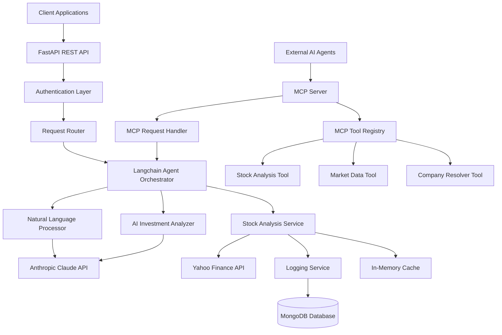

# Design Document

## Overview

The NASDAQ Stock Agent is a microservice-based AI system that provides intelligent stock analysis and investment recommendations. The system combines natural language processing, real-time market data, and AI-powered analysis to deliver comprehensive stock insights through a REST API.

### Key Design Principles
- **Modular Architecture**: Separation of concerns with distinct layers for API, business logic, and data access
- **AI-First Approach**: Leveraging Anthropic's Claude for natural language understanding and investment analysis
- **Real-time Data Integration**: Direct integration with Yahoo Finance for up-to-date market information
- **Comprehensive Logging**: Full audit trail of all analyses and system interactions
- **Scalable Design**: Built to handle concurrent requests and future feature expansion

## Architecture

### System Architecture Diagram



### Component Architecture

The system follows a layered architecture pattern with Langchain as the central orchestrator and dual interfaces for access:

1. **Presentation Layer**: FastAPI REST endpoints and MCP Server interface
2. **Protocol Layer**: MCP (Model Context Protocol) server for standardized AI agent integration
3. **Agent Orchestration Layer**: Langchain agent framework managing AI workflows
4. **Business Logic Layer**: Stock analysis and AI processing services
5. **Data Access Layer**: MongoDB logging and Yahoo Finance integration
6. **External Services**: Anthropic Claude API and Yahoo Finance API

## Components and Interfaces

### 1. FastAPI REST API Layer

**Purpose**: Handles HTTP requests and responses, input validation, and API documentation

**Key Components**:
- `StockAnalysisRouter`: Main endpoint for stock analysis requests
- `HealthCheckRouter`: System health and status endpoints
- `ValidationMiddleware`: Input validation and sanitization
- `ErrorHandlingMiddleware`: Centralized error handling and logging

**API Endpoints**:
```python
POST /api/v1/analyze
GET /api/v1/health
GET /api/v1/logs/{analysis_id}
```

### 2. Langchain Agent Orchestrator

**Purpose**: Coordinates the entire stock analysis workflow using Langchain's agent framework

**Key Components**:
- `StockAnalysisAgent`: Main Langchain agent that orchestrates the analysis process
- `ToolRegistry`: Registers and manages available tools (NLP, market data, AI analysis)
- `WorkflowExecutor`: Executes the multi-step analysis workflow
- `MemoryManager`: Maintains conversation context and analysis history

**Langchain Tools**:
```python
class StockAnalysisTools:
    - company_name_resolver: Tool for converting names to tickers
    - market_data_fetcher: Tool for retrieving Yahoo Finance data
    - ai_analyzer: Tool for generating investment recommendations
    - data_logger: Tool for persisting analysis results
```

**Agent Workflow**:
1. Parse natural language query
2. Resolve company name to ticker symbol
3. Fetch 6-month historical market data
4. Generate AI-powered investment analysis
5. Log results and return structured response

### 3. Natural Language Processing Service

**Purpose**: Converts natural language company names to NASDAQ ticker symbols

**Key Components**:
- `CompanyNameResolver`: Maps company names to ticker symbols
- `SymbolValidator`: Validates ticker symbols against NASDAQ listings
- `FuzzyMatcher`: Handles approximate company name matching

**Interface**:
```python
class NLPService:
    async def resolve_company_name(self, company_name: str) -> str
    async def validate_ticker(self, ticker: str) -> bool
    async def suggest_alternatives(self, invalid_name: str) -> List[str]
```

### 4. Stock Analysis Service

**Purpose**: Orchestrates market data retrieval and AI analysis

**Key Components**:
- `MarketDataFetcher`: Retrieves data from Yahoo Finance
- `DataProcessor`: Processes and normalizes market data
- `AnalysisOrchestrator`: Coordinates the analysis workflow

**Interface**:
```python
class StockAnalysisService:
    async def analyze_stock(self, ticker: str) -> StockAnalysis
    async def get_market_data(self, ticker: str) -> MarketData
    async def generate_summary(self, data: MarketData) -> StockSummary
```

### 5. AI Investment Analyzer

**Purpose**: Generates investment recommendations using Anthropic Claude

**Key Components**:
- `ClaudeClient`: Interface to Anthropic API
- `PromptBuilder`: Constructs analysis prompts with market data
- `RecommendationParser`: Parses AI responses into structured recommendations

**Interface**:
```python
class AIAnalyzer:
    async def analyze_investment_opportunity(self, data: MarketData) -> InvestmentRecommendation
    async def generate_reasoning(self, recommendation: str, data: MarketData) -> str
    def calculate_confidence_score(self, analysis: str) -> float
```

### 6. Logging Service

**Purpose**: Manages persistent logging to MongoDB with 30-day retention

**Key Components**:
- `MongoDBClient`: Database connection and operations
- `LogEntryBuilder`: Structures log entries
- `RetentionManager`: Handles 30-day data cleanup

**Interface**:
```python
class LoggingService:
    async def log_analysis(self, request: AnalysisRequest, response: AnalysisResponse) -> str
    async def log_error(self, error: Exception, context: dict) -> None
    async def cleanup_old_entries(self) -> int
```

### 7. Yahoo Finance Integration

**Purpose**: Retrieves real-time and historical market data

**Key Components**:
- `YFinanceClient`: Wrapper around yfinance library
- `DataValidator`: Validates retrieved market data
- `InMemoryCacheManager`: Implements in-memory caching for market data

**Interface**:
```python
class YFinanceService:
    async def get_current_data(self, ticker: str) -> CurrentMarketData
    async def get_historical_data(self, ticker: str, months: int = 6) -> HistoricalData
    async def validate_ticker_exists(self, ticker: str) -> bool
```

### 8. MCP Server Integration

**Purpose**: Exposes stock analysis capabilities through Model Context Protocol for external AI agents

**Key Components**:
- `MCPServer`: Main MCP protocol server implementation
- `MCPToolRegistry`: Manages available MCP tools and their schemas
- `MCPRequestHandler`: Processes incoming MCP requests and routes to appropriate services
- `MCPResponseFormatter`: Formats responses according to MCP specification

**MCP Tools**:
```python
class MCPTools:
    analyze_stock: Tool for complete stock analysis workflow
    get_market_data: Tool for retrieving market data only
    resolve_company_name: Tool for company name to ticker conversion
```

**Interface**:
```python
class MCPServer:
    async def start_server(self, host: str, port: int) -> None
    async def register_tools(self, tools: List[MCPTool]) -> None
    async def handle_tool_call(self, tool_name: str, parameters: dict) -> MCPResponse
    async def list_available_tools(self) -> List[MCPToolSchema]
```

**MCP Tool Definitions**:
```python
@dataclass
class MCPToolSchema:
    name: str
    description: str
    parameters: dict  # JSON Schema for parameters
    
# Example tool schemas
ANALYZE_STOCK_TOOL = MCPToolSchema(
    name="analyze_stock",
    description="Analyze a NASDAQ stock and provide investment recommendations",
    parameters={
        "type": "object",
        "properties": {
            "company_name_or_ticker": {
                "type": "string",
                "description": "Company name (e.g., 'Apple') or ticker symbol (e.g., 'AAPL')"
            }
        },
        "required": ["company_name_or_ticker"]
    }
)

GET_MARKET_DATA_TOOL = MCPToolSchema(
    name="get_market_data",
    description="Retrieve current and historical market data for a stock",
    parameters={
        "type": "object", 
        "properties": {
            "ticker": {
                "type": "string",
                "description": "Stock ticker symbol (e.g., 'AAPL')"
            },
            "include_historical": {
                "type": "boolean",
                "description": "Whether to include 6-month historical data",
                "default": True
            }
        },
        "required": ["ticker"]
    }
)

RESOLVE_COMPANY_NAME_TOOL = MCPToolSchema(
    name="resolve_company_name", 
    description="Convert company name to NASDAQ ticker symbol",
    parameters={
        "type": "object",
        "properties": {
            "company_name": {
                "type": "string",
                "description": "Company name to resolve (e.g., 'Apple Inc.')"
            }
        },
        "required": ["company_name"]
    }
)
```

## Langchain Integration

### Agent Architecture

The system uses Langchain's agent framework to orchestrate the complex workflow of stock analysis. The agent acts as an intelligent coordinator that serves both REST API and MCP protocol requests:

1. **Interprets User Intent**: Uses Claude to understand natural language queries about stocks
2. **Plans Execution**: Determines the sequence of tools needed for analysis
3. **Executes Tools**: Calls appropriate services (NLP, market data, AI analysis) in the correct order
4. **Synthesizes Results**: Combines outputs from multiple tools into a coherent response
5. **Protocol Adaptation**: Formats responses appropriately for REST API or MCP protocol consumers

### Langchain Tools Implementation

```python
from langchain.agents import Tool
from langchain.agents import AgentExecutor, create_react_agent
from langchain_anthropic import ChatAnthropic

# Define tools for the agent
tools = [
    Tool(
        name="company_name_resolver",
        description="Converts company names to NASDAQ ticker symbols",
        func=nlp_service.resolve_company_name
    ),
    Tool(
        name="market_data_fetcher", 
        description="Retrieves current and 6-month historical stock data from Yahoo Finance",
        func=yfinance_service.get_comprehensive_data
    ),
    Tool(
        name="investment_analyzer",
        description="Generates AI-powered investment recommendations based on market data",
        func=ai_analyzer.analyze_investment_opportunity
    ),
    Tool(
        name="analysis_logger",
        description="Logs analysis results to MongoDB with 30-day retention",
        func=logging_service.log_analysis
    )
]

# Create the agent with Claude as the LLM
llm = ChatAnthropic(model="claude-3-sonnet-20240229")
agent = create_react_agent(llm, tools, prompt_template)
agent_executor = AgentExecutor(agent=agent, tools=tools, verbose=True)
```

### Agent Workflow Example

```
User Query: "What do you think about Apple stock?"

Agent Reasoning:
1. I need to analyze Apple stock for the user
2. First, let me resolve "Apple" to its ticker symbol
3. Then fetch current and historical market data
4. Analyze the data for investment recommendations
5. Log the analysis and return results

Tool Execution:
1. company_name_resolver("Apple") → "AAPL"
2. market_data_fetcher("AAPL") → MarketData object with 6-month history
3. investment_analyzer(market_data) → InvestmentRecommendation
4. analysis_logger(request, response) → Log entry created

Final Response: Structured analysis with recommendation, confidence score, and reasoning
```

### MCP Integration Workflow

```
External AI Agent Request via MCP:
{
  "method": "tools/call",
  "params": {
    "name": "analyze_stock",
    "arguments": {
      "company_name_or_ticker": "Apple"
    }
  }
}

MCP Server Processing:
1. MCPRequestHandler receives and validates the request
2. Routes to MCPToolRegistry.execute_tool("analyze_stock", {"company_name_or_ticker": "Apple"})
3. MCPToolRegistry delegates to the same Langchain agent used by REST API
4. Agent executes the same workflow as above
5. MCPResponseFormatter converts result to MCP-compliant response

MCP Response:
{
  "content": [
    {
      "type": "text", 
      "text": "Analysis complete for Apple Inc. (AAPL)"
    },
    {
      "type": "resource",
      "resource": {
        "uri": "analysis://aapl/2024-11-06",
        "mimeType": "application/json",
        "text": "{\"ticker\": \"AAPL\", \"recommendation\": \"Buy\", \"confidence\": 85, ...}"
      }
    }
  ]
}
```

## Data Models

### Core Data Structures

```python
@dataclass
class MarketData:
    ticker: str
    company_name: str
    current_price: float
    daily_high: float
    daily_low: float
    volume: int
    historical_prices: List[PricePoint]
    market_cap: Optional[float]
    pe_ratio: Optional[float]

@dataclass
class PricePoint:
    date: datetime
    open_price: float
    close_price: float
    high_price: float
    low_price: float
    volume: int

@dataclass
class InvestmentRecommendation:
    recommendation: str  # "Buy", "Hold", "Sell"
    confidence_score: float  # 0-100
    reasoning: str
    key_factors: List[str]
    risk_assessment: str

@dataclass
class StockAnalysis:
    analysis_id: str
    ticker: str
    company_name: str
    query_text: str
    market_data: MarketData
    recommendation: InvestmentRecommendation
    summary: str
    timestamp: datetime
    processing_time_ms: int

@dataclass
class AnalysisLogEntry:
    analysis_id: str
    user_query: str
    ticker_symbol: str
    recommendation: str
    confidence_score: float
    processing_time_ms: int
    timestamp: datetime
    expires_at: datetime  # 30 days from creation
```

### MongoDB Schema

```javascript
// analyses collection
{
  _id: ObjectId,
  analysis_id: String,
  user_query: String,
  ticker_symbol: String,
  company_name: String,
  market_data: {
    current_price: Number,
    daily_high: Number,
    daily_low: Number,
    volume: Number,
    historical_data: Array
  },
  recommendation: {
    action: String,
    confidence_score: Number,
    reasoning: String,
    key_factors: Array
  },
  processing_time_ms: Number,
  timestamp: Date,
  expires_at: Date  // TTL index for 30-day retention
}

// errors collection
{
  _id: ObjectId,
  error_type: String,
  error_message: String,
  stack_trace: String,
  context: Object,
  timestamp: Date,
  expires_at: Date
}
```

## Error Handling

### Error Categories and Responses

1. **Input Validation Errors**
   - Invalid company names
   - Malformed requests
   - Missing required parameters

2. **External Service Errors**
   - Yahoo Finance API failures
   - Anthropic API rate limits
   - Network connectivity issues

3. **System Errors**
   - Database connection failures
   - Internal processing errors
   - Memory/resource constraints

### Error Response Format

```python
@dataclass
class ErrorResponse:
    error_code: str
    error_message: str
    details: Optional[dict]
    suggestions: Optional[List[str]]
    timestamp: datetime
```

### Retry Strategy

- **Exponential Backoff**: For transient API failures
- **Circuit Breaker**: For persistent external service failures
- **Graceful Degradation**: Return cached data when real-time data unavailable

## Testing Strategy

### Unit Testing
- **Service Layer Tests**: Mock external dependencies
- **Data Model Tests**: Validate serialization/deserialization
- **Utility Function Tests**: Test helper functions and validators

### Integration Testing
- **API Endpoint Tests**: Test complete request/response cycles
- **Database Integration**: Test MongoDB operations and TTL behavior
- **External Service Integration**: Test Yahoo Finance and Anthropic API calls

### Performance Testing
- **Load Testing**: Simulate concurrent user requests
- **Response Time Testing**: Ensure sub-10-second response times
- **Memory Usage Testing**: Monitor resource consumption under load

### Test Data Strategy
- **Mock Market Data**: Predefined datasets for consistent testing
- **Test Company Database**: Known company name to ticker mappings
- **Synthetic AI Responses**: Mocked Anthropic responses for testing

## Security Considerations

### API Security
- **Rate Limiting**: Prevent abuse and ensure fair usage
- **Input Sanitization**: Validate and clean all user inputs
- **CORS Configuration**: Proper cross-origin resource sharing setup

### Data Security
- **Connection Encryption**: TLS for all external API calls
- **Credential Management**: Secure storage of API keys and database credentials
- **Data Retention**: Automatic cleanup of sensitive log data after 30 days

### Monitoring and Alerting
- **Health Checks**: Regular system health monitoring
- **Error Rate Monitoring**: Alert on unusual error patterns
- **Performance Monitoring**: Track response times and resource usage

## Deployment Architecture

### Container Strategy
- **Docker Containerization**: Consistent deployment across environments
- **Multi-stage Builds**: Optimized container images
- **Health Check Endpoints**: Container orchestration support
- **Multi-Protocol Support**: Single container serving both REST API and MCP server

### Environment Configuration
- **Development**: Local development with mock services and MCP client testing
- **Staging**: Full integration testing environment with MCP protocol validation
- **Production**: High-availability deployment with monitoring for both REST and MCP interfaces

### Scalability Considerations
- **Horizontal Scaling**: Multiple server instances handling both REST and MCP requests
- **Database Sharding**: MongoDB scaling for high-volume logging from multiple protocols
- **Caching Strategy**: In-memory caching for frequently requested stock data with TTL expiration
- **MCP Connection Management**: Efficient handling of persistent MCP connections from multiple external agents

### MCP Server Configuration

```python
# MCP Server Settings
MCP_SERVER_CONFIG = {
    "host": "0.0.0.0",
    "port": 8001,  # Separate port from REST API
    "max_connections": 100,
    "connection_timeout": 300,  # 5 minutes
    "tool_execution_timeout": 60,  # 1 minute per tool call
    "enable_logging": True,
    "log_mcp_requests": True
}

# MCP Tool Registration
MCP_TOOLS = [
    "analyze_stock",
    "get_market_data", 
    "resolve_company_name"
]
```